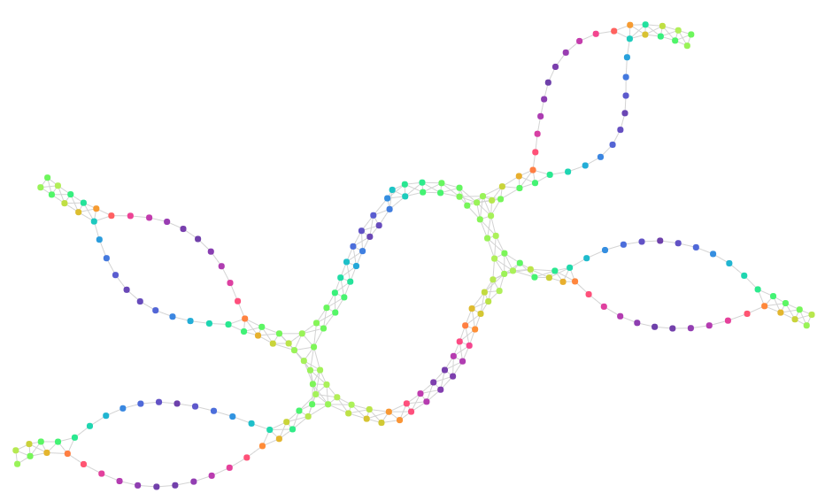

# pySTAD - Python implementation of Simplified Topological Abstraction of Data

## Hacking
- Install [Poetry](https://github.com/python-poetry/poetry), the dependency manager.
- Run `poetry install` in the root. This will create a virtual environment containing all necessary dependencies.
- Use `poetry shell` to enter the virtual environment.
- Run `python compare.py optimized circles --debug` to check everything is working.

### compare.py

This script implements a CLI to easily test different datasets and different STAD implementations.

Run `python compare.py --help` to see the options.

#### Run STAD on five circles using the base implementation
`python compare.py base circles --debug`

#### Run STAD on five circles using the optimized implementation
`python compare.py optimized circles --debug`

#### Run STAD on horse using the optimized implementation without visualizing (handy for quick checks)
`python compare.py optimized horse --debug --no-viz`

## Usage
The input to `stad` is a _normalised distance matrix_ (i.e. with values between 0 and 1). Optionally, you can also provide an array of values for each datapoint that can be used in the lens.

Let's for example look at the five circles dataset that is used in the example script below. Without a lens, a `stad` analysis will reveal a circle with four spikes; with a lens each of these spikes itself also becomes a circle (as in the picture).



The data for this dataset looks like this:
```
x,y,hue
377,566,#1F988B
362,589,#21A585
350,607,#29AF7F
104,977,#20928C
124,978,#26818E
118,956,#1F9E89
...
```

Here's a complete script to create this graph:

```python
import stad
import pandas as pd

## Load the data
url = 'https://gist.githubusercontent.com/jandot/a84c0505cdc8008a6e5ae5032532a39f/raw/d834527117fd204d33486998d10290251354d013/five_circles.csv'
data = pd.read_csv(url, header=0)

## Extract the values we want to use in our distance, the lens, and optional features
values = data[['x','y']].values.tolist()
lens = data['hue'].map(lambda x:stad.hex_to_hsv(x)[0]).values
xs = data['x'].values.tolist()
ys = data['y'].values.tolist()
hues = data['hue'].values.tolist()

## Create the distance matrix in the high_dimensional space. This can be using
## cosine distance, euclidean, or any other.
highD_dist_matrix = stad.calculate_highD_dist_matrix(values)

## Run STAD and show the result
g = stad.run_stad(highD_dist_matrix, lens=lens, features={'x':xs, 'y':ys, 'hue': hues})
stad.draw_stad(g)
```